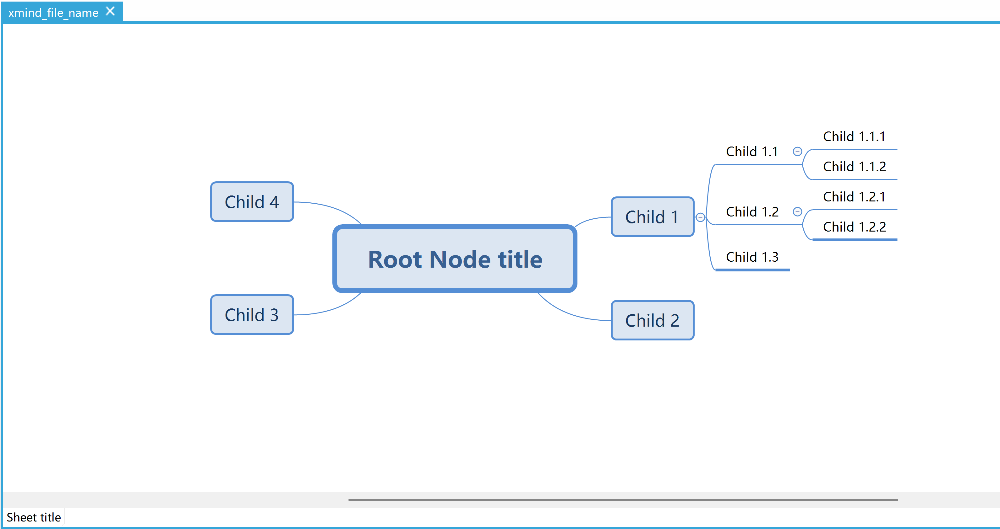
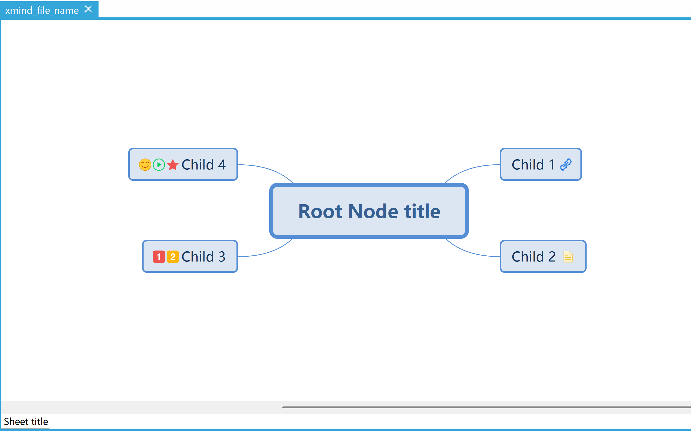
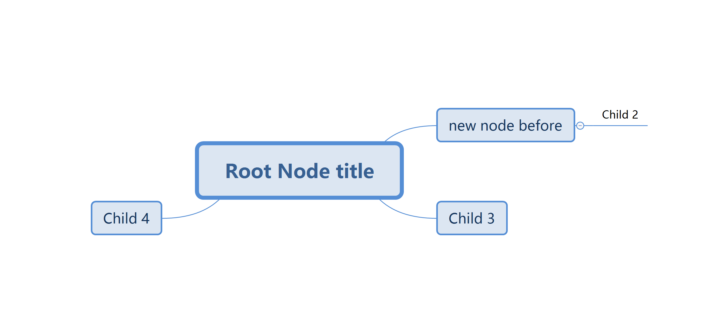

# goxmind

`goxmind` 是一个用 Go 语言编写的库，用于创建、操作和保存 XMind 格式的思维导图文件。方便构建思维导图的结构，并将其保存为标准的 XMind 文件。

## 功能特性
- **思维导图结构创建**：支持创建 XMind 文件、添加画布、根节点和子节点。
- **节点属性设置**：可以为节点添加图标、备注、链接。
- **json文件加载**：支持按照定义好的json结构生成xmind文件。

## 兼容性
- **支持的 XMind 版本**：已测试通过可支持 旧版xmind8 和 Xmind (2025) ，如果有其他版本需求请联系我。


## 安装指南
### 环境要求
- Go 语言环境（建议 1.18 及以上版本）


### 安装步骤
可以在 `go.mod` 文件中添加如下引用：
```bash
go get github.com/vivian0517/goxmind
```

## 使用方法
### 示例代码
```go
package main

import "github.com/vivian0517/goxmind"

func main() {
	// 初始化
	xmind := goxmind.New()
	// 添加画布标题和根节点标题
	rootNode := xmind.AddSheet("Sheet title", "Root Node title")

	// 添加子节点标题
	child1 := rootNode.AddNode("Child 1") // 如果要在此节点增加图标超链接等需要保存返回值
	// 给child1节点设置超链接
	child1.AddHref("www.example.com")

	child2 := rootNode.AddNode("Child 2")
	// 给child2节点设置备注
	child2.AddNotes("Notes")

	child3 := rootNode.AddNode("Child 3")
	// 给child3节点设置图标 🔢 优先级
	child3.AddMaker(goxmind.Priority1)
	child3.AddMaker(goxmind.Priority2)

	child4 := rootNode.AddNode("Child 4")
	// 给child4节点设置图标 ⭐ 星星
	child4.AddMaker(goxmind.StarRed)
	// 给child4节点设置图标 😊 表情
	child4.AddMaker(goxmind.SmileySmile)
	// 给child4节点设置图标 ✅ 任务进度
	child4.AddMaker(goxmind.Task0_8)
	// 更多图标参考marker.go中MarkerId常量

	// 保存xmind,".xmind"文件后缀可填也可不填
	xmind.Save("xmind_file_name")
}

```

### 运行示例
将上述代码保存为 `main.go`，然后在终端中运行：
```bash
go run main.go
```
### 结果
运行示例后，您会在同一目录下找到一个名为 xmind_file_name.xmind 的文件。这个文件就是生成的 XMind 文件。



## 功能特性
1.添加备注/图标/超链接
```go
package main

import "github.com/vivian0517/goxmind"

func main() {
	// 初始化
	xmind := goxmind.New()
	// 添加画布标题和根节点标题
	rootNode := xmind.AddSheet("Sheet title", "Root Node title")

	// 添加子节点标题
	child1 := rootNode.AddNode("Child 1") // 如果要在此节点增加图标超链接等需要保存返回值
	// 给child1节点设置超链接
	child1.AddHref("www.example.com")

	child2 := rootNode.AddNode("Child 2")
	// 给child2节点设置备注
	child2.AddNotes("Notes")

	child3 := rootNode.AddNode("Child 3")
	// 给child3节点设置图标 🔢 优先级
	child3.AddMaker(goxmind.Priority1)
	child3.AddMaker(goxmind.Priority2)

	child4 := rootNode.AddNode("Child 4")
	// 给child4节点设置图标 ⭐ 星星
	child4.AddMaker(goxmind.StarRed)
	// 给child4节点设置图标 😊 表情
	child4.AddMaker(goxmind.SmileySmile)
	// 给child4节点设置图标 ✅ 任务进度
	child4.AddMaker(goxmind.Task0_8)
	// 更多图标参考marker.go中MarkerId常量

	// 保存xmind,".xmind"文件后缀可填也可不填
	xmind.Save("xmind_file_name")
}
```


2.解析指定路径json文件，生成指定文件名xmind
```go
package main

import "github.com/vivian0517/goxmind"

func main() {
	//在项目路径下创建一个jsondata.txt文件，PraseJsonSaveXmind可以读取txt生成指定文件名xmind，json结构示例如下
	goxmind.PraseJsonSaveXmind("xmind_file_name")
}
```
json结构示例如下
```json
{
  "filename": "xmind_file_name.xmind",
  "sheet": [
    {
      "sheetTitle": "Sheet title",
      "node": {
        "nodeTitle": "Root Node title",
        "children": [
          {
            "nodeTitle": "Child 1",
            "children": [
              {
                "nodeTitle": "Child 1.1",
                "children": [
                  {
                    "nodeTitle": "Child 1.1.1"
                  },
                  {
                    "nodeTitle": "Child 1.1.2"
                  }
                ]
              },
              {
                "nodeTitle": "Child 1.2",
                "children": [
                  {
                    "nodeTitle": "Child 1.2.1"
                  },
                  {
                    "nodeTitle": "Child 1.2.2"
                  }
                ]
              },
              {
                "nodeTitle": "Child 1.3"
              }
            ]
          },
          {
            "nodeTitle": "Child 2"
          },
          {
            "nodeTitle": "Child 3"
          },
          {
            "nodeTitle": "Child 4"
          }
        ]
      }
    }
  ]
}
```
3.加载指定xmind文件(兼容新老版本)
打印/保存json结构
删除某节点
添加节点在某节点之前

```go
package main

import (
	"fmt"

	"github.com/vivian0517/goxmind"
)

func main() {
	//加载指定xmind文件，兼容新老版本
	xmind, err := goxmind.Load("xmind_file_name")
	if err != nil {
		fmt.Print("err:", err)
	}
	//打印json结构
	xmind.PrintJson()
	//保存json结构
	xmind.SaveJson("save.txt")
	//删除某个节点
	xmind.DeleteNode(xmind.Sheets[0].Node.Children[0])
	//添加节点在某个节点之前
	xmind.AddNodeBefore(xmind.Sheets[0].Node.Children[0], "new node before")
	xmind.Save("filename")
}
```


## 贡献指南
如果你希望为 `goxmind` 项目做出贡献，请遵循以下步骤：
1. Fork 本仓库
2. 创建你的特性分支 (`git checkout -b feature/AmazingFeature`)
3. 提交你的更改 (`git commit -m 'Add some AmazingFeature'`)
4. 将更改推送到分支 (`git push origin feature/AmazingFeature`)
5. 打开一个 Pull Request

## 许可证
本项目采用 [MIT 许可证](LICENSE)。

## 联系方式
如果你有任何问题或建议，请在 GitHub 仓库中提交 issue。 
